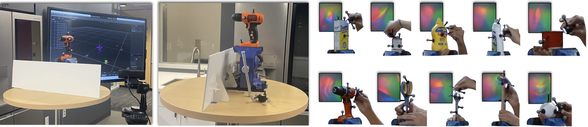

# **YCB-Slide**: A tactile interaction dataset

[![CC BY-SA 4.0][cc-by-sa-shield]][cc-by-sa] &nbsp; [](https://opensource.org/licenses/MIT) &nbsp;&nbsp;&nbsp;&nbsp;&nbsp;&nbsp;  &nbsp;&nbsp;  

[cc-by-sa]: http://creativecommons.org/licenses/by-sa/4.0/
[cc-by-sa-shield]: https://img.shields.io/badge/License-CC%20BY--SA%204.0-lightgrey.svg

<div align="center">
  
</div>

The YCB-Slide dataset comprises of [DIGIT](https://digit.ml/) sliding interactions on [YCB](https://www.ycbbenchmarks.com) objects. We envision this can contribute towards efforts in tactile localization, mapping, object understanding, and learning dynamics models. We provide access to DIGIT images, sensor poses, RGB video feed, ground-truth mesh models, and ground-truth heightmaps + contact masks (simulation only). This dataset is supplementary to the [MidasTouch paper](https://openreview.net/forum?id=JWROnOf4w-K), a [CoRL 2022](https://corl2022.org/) submission. 



---
## Getting started: **Dataset**

The recommended way to download the YCB-Slide is through `download_dataset.sh` (before you do, please run `pip install gdown`). Or, you could download object-specific data here:

--- 

## Getting started: **Code**

### Setup the environment

```
conda env create -f environment.yml 
conda activate ycb_slide
pip install -e .
```

### Download dataset

```bash
chmod +x download_dataset.sh   
./download_dataset.sh  # requires gdown
```
Or, you could download object-specific data [here](#Dataset-details).

### Visualize dataset

```python
# Visualize trajectory
python visualize_trajectory.py --data_path dataset/real/035_power_drill/dataset_0 --object 035_power_drill --real # real dataset
python visualize_trajectory.py --data_path dataset/sim/035_power_drill/00 --object 035_power_drill # sim dataset

# Visualize tactile data
python visualize_tactile.py --data_path dataset/real/035_power_drill/dataset_0 --object 035_power_drill --real  # real dataset
python visualize_tactile.py --data_path dataset/sim/035_power_drill/00 --object 035_power_drill  # sim dataset
```

## Record your own data

Plug in your DIGIT (and webcam optionally), and record your own trajectories: 
```python
python record_data_expt.py --duration 60 --webcam_port 2 --object 035_power_drill # record DIGIT images and webcam
```

You can also timesync and align your data with these scripts:
```python
python timesync_digit.py --digit_file dataset/real/035_power_drill/dataset_0/digit_data.npy --tracking_file dataset/real/035_power_drill/035_power_drill.csv --bodies "DIGIT 035_power_drill" # timesync optitrack and DIGIT data

python align_data.py --data_path dataset/real/035_power_drill --object 035_power_drill # manually alignment fine-tuning
```

---

## Dataset details

**YCB objects**: We select 10 YCB objects with diverse geometries in our tests: sugar_box, tomato_soup_can,
mustard_bottle, bleach_cleanser, mug, power_drill, scissors, adjustable_wrench, hammer, and baseball. You can download the ground-truth meshes [here](https://drive.google.com/file/d/1pAQXSQ3K_mLSegFFHuRg2TvyMIf5wX0d/view?usp=sharing). 

<div align="center">  </div>

**Simulation**: We simulate sliding across the objects using [TACTO](https://github.com/facebookresearch/tacto), mimicking realistic interaction sequences. The pose sequences are geodesic-paths of fixed length L = 0.5m, connecting random waypoints on the mesh. We corrupt sensor poses with zero-mean Gaussian noise $σ_\text{trans} = 0.5\text{mm}, \  σ_\text{rot} = 1^{\circ}$. We record five trajectories per-object, 50 interactions in total.

<div align="center">  </div>

**Real-world**: We perform sliding experiments through handheld operation of the DIGIT. We keep each YCB object stationary with a heavy-duty bench vise, and slide along the surface and record 60 secs trajectories at 30Hz. We use an [OptiTrack](https://optitrack.com/) system for timesynced sensor poses (`synced_data.npy`), with 8 cameras tracking the reflective markers. We affix six markers on the DIGIT and four on each test object. The canonical object pose is adjusted to agree with the ground-truth mesh models. Minor misalignment of sensor poses are rectified by postprocessing  (`alignment.npy`). We record five logs per-object, for a total of 50 sliding interactions

<div align="center">

Representative experiments            |  All 50 trajectories
:-------------------------:|:-------------------------:
  |  

</div>


<div align="center">

| Object  | Sim data | Real data | Object  | Sim data | Real data |
| -- | -- |  -- | -- | -- |  -- |
| 004_sugar_box |  [[100.6 MB]](https://drive.google.com/file/d/1UBzs2FqRv4AfWJdETJbCtSLaod6UpxCU/view?usp=sharing) | [[321.9 MB]](https://drive.google.com/file/d/1lgvUTAwj767dKUwIiEqlIpbkjvrfVVFq/view?usp=sharing) | 035_power_drill |   [[111.3 MB]](https://drive.google.com/file/d/1speBNOyUCGMEHY1uq4LORuHzwOfKC_iA/view?usp=sharing) | [[339.1 MB]](https://drive.google.com/file/d/1YMcHvKpJhqHdB6NHLJ88wto-W9XlMhMo/view?usp=sharing) |
| 005_tomato_soup_can |  [[147.9 MB ]](https://drive.google.com/file/d/1F1EAovRyfajZxn5dcvB3H2dL1Lz7kAX2/view?usp=sharing) | [[327.4 MB]](https://drive.google.com/file/d/1LWdR6MSY4upcdzV3keOyQt4YMOrMa2Cy/view?usp=sharing) | 037_scissors |    [[109 MB]](https://drive.google.com/file/d/1zTcAt0c_JVQz2leRi75sopIO66oTQm4P/view?usp=sharing) | [[320 MB]](https://drive.google.com/file/d/1gyeAAwicGcf3LTmXUitOlJsDqgrrtK9n/view?usp=sharing) |
| 006_mustard_bottle |   [[102.7 MB]](https://drive.google.com/file/d/1rgxy-eHYxVaxjmP47FYPOUMTo9buIkCZ/view?usp=sharing) | [[319.4 MB]](https://drive.google.com/file/d/10XQDN7hqMTly7x2AClYf1ewfvaEnBpTg/view?usp=sharing) | 042_adjustable_wrench |  [[147.7 MB]](https://drive.google.com/file/d/1zTcAt0c_JVQz2leRi75sopIO66oTQm4P/view?usp=sharing) | [[326.9 MB]](https://drive.google.com/file/d/1-4u2oReKdOUAr5p2CkNFSDiI6XQT1WFw/view?usp=sharing) |
| 021_bleach_cleanser |   [[86.5 MB]](https://drive.google.com/file/d/1VOkQJdIlF0FMxIQIu2bLAxnSpTX7aStA/view?usp=sharing) | [[318.5 MB]](https://drive.google.com/file/d/1ATcCN2GghbrKS1d_7fQ6Zmjcexfy74XL/view?usp=sharing) | 048_hammer |    [[102 MB]](https://drive.google.com/file/d/14qy3dicUHd50qYeGgueoHy9yFDjSxvfF/view?usp=sharing) | [[320.9 MB]](https://drive.google.com/file/d/10N-Q90Q3k2_gYL-Wd0Q5U1jnjpIpBiA3/view?usp=sharing) |
| 025_mug |   [[107 MB]](https://drive.google.com/file/d/10h5ur3scGTbGCPd_7RrvgW_dGJh__911/view?usp=sharing) | [[325.5 MB]](https://drive.google.com/file/d/11_jJwjtAPLMK-vLDrJxaguaWj8D6L0iH/view?usp=sharing) | 055_baseball |    [[153.4 MB]](https://drive.google.com/file/d/1SwXLk43HDTl0fgN8P89g_QMFnKpIqBZG/view?usp=sharing) | [[331.1 MB]](https://drive.google.com/file/d/10JXm9nxxodKe5qzoRHOmvkWd6y1DoNlY/view?usp=sharing) |
</div>

---

## Data directory format

### Simulation
```bash
sim
├── object_0 # eg: 004_sugar_box
│   ├── 00
│   │   ├── gt_contactmasks # ground-truth contact masks
│   │   │   ├── 0.jpg
│   │   │   └── ...
│   │   ├── gt_heightmaps # ground-truth depth maps
│   │   │   ├── 0.jpg
│   │   │   └── ...
│   │   ├── tactile_images # RGB DIGIT images
│   │   │   ├── 0.jpg
│   │   │   └── ...
│   │   ├── tactile_data_noisy.png # 3-D viz w/ noisy poses
│   │   ├── tactile_data.png # 3-D viz
│   │   └──tactile_data.pkl # pose information
│   ├── 01
│   └── ...
├── object_1
└── ...
```

### Real-world
```bash
real
├── object_0 # eg: 004_sugar_box
│   ├── dataset_0
│   │   ├── frames # RGB DIGIT images
│   │   │   ├── frame_0000000.jpg
│   │   │   ├── frame_0000001.jpg
│   │   │   └── ...
│   │   ├── webcam_frames # RGB webcam images
│   │   │   ├── frame_0000000.jpg
│   │   │   ├── frame_0000001.jpg
│   │   │   └── ...
│   │   ├── digit_data.npy # pose information
│   │   ├── frames.mp4 # RGB DIGIT video
│   │   ├── synced_data.npy # timesynced image/pose data
│   │   ├── tactile_data.png # 3-D viz
│   │   └── 3d_rigid_bodies.pdf # pose viz
│   ├── object_0.csv # raw optitrack data
│   ├── alignment.npy # adjustment tf matrix
│   └── tactile_data.png # 3-D viz
│   ├── dataset_1
│   └── ...
├── object_1
└── ...
```

---

## License
This dataset is licensed under a
[Creative Commons Attribution-ShareAlike 4.0 International License][cc-by-sa], with the accompanying code licensed under the [MIT License](https://opensource.org/licenses/MIT). 

---

## Citation
If you use YCB-Slide dataset in your research, please cite:
```BibTeX
@inproceedings{suresh2022midastouch,
    title={{M}idas{T}ouch: {M}onte-{C}arlo inference over distributions across sliding touch},
    author={Suresh, Sudharshan and Si, Zilin and Anderson, Stuart and Kaess, Michael and Mukadam, Mustafa},
    booktitle = {Proc. Conf. on Robot Learning, CoRL},
    address = {Auckland, NZ},
    month = dec,
    year = {2022}
}
```
